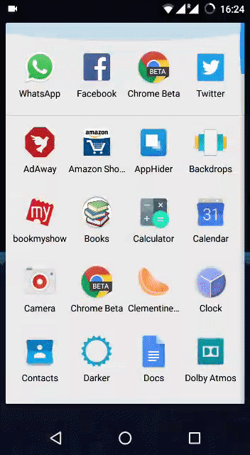
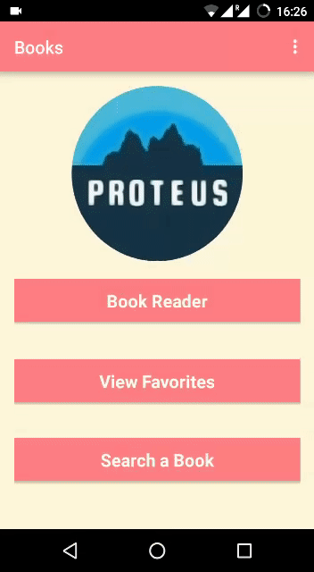

# Books_AndroidApp
It's an Android App to compare prices of books online in India. It's also an ebook reader supporting epub files. 
You can search a book with the book's name/author's name and you'll get a list of books. Once you select the desired book, you'll get a short description of the book. There you can choose to compare price of the books on different e-commerce website. You'll get the least price offered by a particular e-commerce website corresponding to a particular ISBN number. You can choose amongst the choices provided to you by the app and you'll be navigated to seller's site.

 

